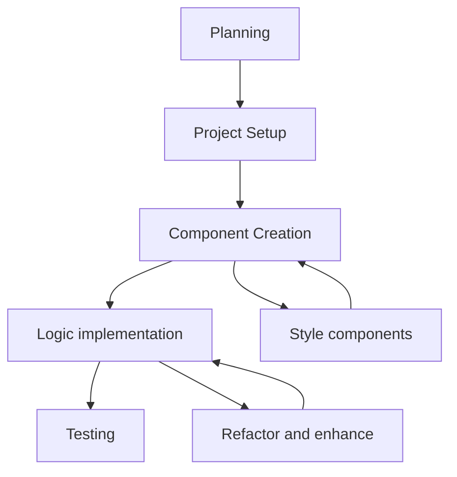

# Seneca - Front-End Task

The task is to make a component using React. The component is intended to test the user's knowledge of a topic, by having them move a series of toggles into the correct positions.

---
## Table of Contents

1. [Installation](#installation)
2. [Requirements](#requirements)
3. [Assumptions](#assumptions)
4. [Approach to the Problem](#approach-to-the-problem)
5. [Planning](#planning)
6. [Project Organisation](#project-organisation)
7. [Components](#components)
8. [Fulfilling the requirements](#fulfilling-the-requirements)
9. [Limitations](#limitations)
10. [Testing](#testing)
11. [Conclusion](#conclusion)

---
## Installation

Make sure you have **Node.js** installed. If not, download it from [nodejs.org](https://nodejs.org/).

1. **Clone the repository:**
```bash  
git clone git@github.com:mattwsheps/seneca-learning-fe-task.git
cd seneca-learning-fe-task.git
```  
  
2. **Install dependencies:** 
```bash  
npm install 
```

3. **Run the development server:**  
```bash  
npm run dev
```

> The server should be running on http://localhost:5173/

---
## Requirements

### UI/UX Requirements

1. The solution should lock once the correct answer is reached so the toggles can no longer be switched
2. The toggles should animate between the two states
3. The background colour should change in proportion to how "correct" the answer is (see video attached)
4. The component should be responsive down to screens 320px wide

### Project Requirements

1. State any assumptions or limitations of your solution in the repository readme
2. Host your solution in a Git repo on Github of Gitlab
3. Please implement your solution in React + Typescript. You may choose any other tools and technologies as you see appropriate
4. The component should be reusable & extendable, it should be able to accommodate the question changing from that in the video to eg.: 
	- Q. "What are the ideal conditions inside an office?" A. (good pay, bad pay) (lot of meetings, less meetings), (free coffee, expensive coffee), (bear in office, dog in office).

---
## Assumptions

1. Background colours change subtly from a red gradient towards a yellow gradient depending on correctness - until 100% correctness which is a cyan gradient.
2. The question data is fetched from an API and would be a JSON object with the following shape for the example data given:

`Question JSON data`
```JSON
{
	"id": "question-1",
	"questionText": "An animal cell contains:",
	"answers": [
	{
		"id": "answer-1",
		"options": [
			{ "id": "opt-1", "optionText": "Cell Wall", "isCorrect": false },
			{ "id": "opt-2", "optionText": "Ribosomes", "isCorrect": true }
		]
	},
	{
		"id": "answer-2",
		"options": [
			{ "id": "opt-1", "optionText": "Cytoplasm", "isCorrect": true },
			{ "id": "opt-2", "optionText": "Chloroplast", "isCorrect": false }
		]
	},
	{
		"id": "answer-3",
		"options": [
			{ "id": "opt-1", "optionText": "Partially permeable membrane", "isCorrect": true },
			{ "id": "opt-2", "optionText": "Impermeable membrane", "isCorrect": false }
		]
	},
	{
		"id": "answer-4",
		"options": [
			{ "id": "opt-1", "optionText": "Cellulose", "isCorrect": false },
			{ "id": "opt-2", "optionText": "Mitochondria", "isCorrect": true }
		]
	}
	]
}
```

---
## Approach to the Problem

Due to time constraints, I decided to forgo a Test-Driven Development (TDD) approach in favor of a streamlined development process. This allowed me to move quickly and ensure that the core functionality of the component was implemented efficiently. My approach to the task followed this pipeline:



1. **Planning:** I diagrammed the architecture and organised the project tasks using a Kanban board. I made wireframes of the component layout, planned out the data structure, and mapped how state, handler functions, and props would flow through the component.

2. **Project Setup:** After planning, I set up the project with Vite, a modern and fast React framework that supports TypeScript. I also setup Tailwind for styling and configured it to my needs.

3. **Component Creation & Styling:** I iterated through component creation systematically, starting with the parent component and fully styling that to match the Figma designs, before progressing to the child components.

4. **Logic Implementation:** After the components were in place, I added the necessary logic in order to fulfil the [UI/UX requirements](#ui/ux-requirements).

5. **Refactor and Enhance:** I continuously refactored the code to improve readability, maintainability and performance.

6. **Testing:** While I didn’t use TDD, I wrote unit tests at the end to verify the functionality of each component.

### Tech Stack

1. **Vite:** 
	A modern, lightweight build tool optimised for React applications, that supports TypeScript.

2. **Tailwind CSS:** 
	It reduces the need for writing custom CSS and offers pre-configured classes for spacing, layouts, and typography, making it easier to maintain a consistent design without switching between files.

3. **clsx & twMerge:**
	`clsx` helps manage dynamic className combinations efficiently without cumbersome string concatenation. `twMerge` allows me to intelligently merge Tailwind CSS class names, especially when dynamically applying conditional classes.

4. **React Query:**
	Instead of using `fetch` in a `useEffect` hook, I opted for React Query to handle the data-fetching logic. React Query simplifies the process by automatically managing loading states, caching, and background refetching.

5. **Framer Motion:**
	It provides a flexible and declarative way to create animations in React, and is ideal for the toggle animation.

6. **Vitest:**
	I chose Vitest as the testing framework because it's fast, lightweight, and tightly integrated with Vite, allowing for seamless unit testing without the need for additional configuration.

---
## Planning  

I began the project by planning out the architecture and design:

• **Wireframing with Excalidraw:** I used Excalidraw to create a wireframe of the component layout. This allowed me to visually break down the UI into reusable components.

• **Component Breakdown:** From the wireframe, I identified the key components and their responsibilities, ensuring that the component structure would be flexible and maintainable.

• **Data Shape and State Plan:** I examined the structure of the data that would be fetched from an API, which informed my design for the state, handler functions, and prop flow between components.

• **Trello Board for Task Management:** I created a Trello board to manage tasks. I let the UI/UX requirements drive the ticket creation, breaking down each feature into smaller, actionable steps.

> Here is a link to the [Trello board](https://trello.com/invite/b/66edd37aa41787d19e2e8685/ATTIe32db9cb726b75911f8ae8cde87e50bbC43F9681/seneca-learning-fe-task) 

---
## Project Organisation

To ensure scalability and maintainability, I organised the project with the following structure:

- **Service Layer:** I assumed the component would be part of a larger codebase, so I designed the architecture with a service function, `fetchQuestionData()`, to retrieve data from an API.
- **Folder Structure:** I separated the project into `components`, `models`, `utils`, `hooks`, and `tests` to keep concerns separated and maintainable. This structure makes the project easier to extend and integrate into a larger application.

```bash
├── src/
│   ├── components/      # UI components
│   ├── services/        # Business logic
│   ├── utils/           # Utility functions
│   ├── models/          # Data models
│   └── hooks/           # Custom hooks
├── tests/               # Test files
├── App.tsx              # Main app component
├── index.css            # Global styles
└── main.tsx             # App entry point
```

---
## Components

I designed the component structure to ensure all state was lifted to the parent component, establishing a single source of truth to prevent inconsistencies.

1. **Question Component (Parent)**:
    
    - Fetches question data using **React Query** and a service-layer `fetchQuestionData` function.
    - Manages the state of selected options and determines the correctness of the answer.
    - Handles logic for dynamically changing background colour based on answer correctness.
    - Renders the question heading, multiple **AnswerToggle** components based on the fetched data, and a footer showing if the answer is correct.

2. **AnswerToggle Component (Child)**:
    
    - Renders **AnswerToggleButton** components based on the number of options in the answer object.
    - Uses **Framer Motion** to animate a div element that transitions between the buttons, depending on which option is selected.

3. **AnswerToggleButton Component (Grandchild)**:
    
    - Handles user interactions by allowing them to click and select an answer.
    - Responds to parent state changes, such as enabling/disabling based on correctness.

---
## Fulfilling the Requirements

- **"The toggles should animate between the two states"** 
	Since my approach prioritised styling first, I addressed this requirement early. Using a **Framer Motion** div, I animated the movement of the toggle between the two button positions based on which one is selected.
    
- **"The solution should lock once the correct answer is reached so the toggles can no longer be switched"** 
	I created custom hooks to initialise and manage the state of selected options and determine correctness. Once all answers were correct, a boolean state was set to `true`, which was passed down to the buttons to disable further interaction.
    
- **"The background colour should change in proportion to how 'correct' the answer is"** 
	I used the same custom hooks in combination with utility functions to calculate dynamic colour changes. As outlined in the [assumptions](#assumptions), I achieved this by interpolating HSL values between red (incorrect) and yellow (partially correct), transitioning to cyan when all answers were correct, as seen in the Figma designs and attached video.
    
- **"The component should be responsive down to screens 320px wide"** 
	Initially, I used **Tailwind CSS** breakpoints to adjust font sizes and padding, which worked well for most cases but caused text overflow with longer words. To address this, I decided to implement a stacked layout for the toggles when overflow was detected. However, this initially posed an issue, as my first approach compared `scrollWidth` to `clientWidth` to detect overflow. This caused an infinite loop: when the layout switched from horizontal to vertical, the overflow condition would disappear, causing it to switch back, leading to continuous flickering. The core issue was that the layout itself became a dependency for the overflow check, creating a circular problem.
    
    To overcome this, I implemented a new solution that measures the length of individual words against the available space in the horizontal layout. If a word exceeds this width, the layout switches to vertical and stays stable. This method avoids relying on the current layout state and instead bases the decision purely on content, breaking the feedback loop. By measuring word length rather than the container’s overflow, the solution is now both more accurate and stable.

---
## Testing

Given more time, I would have adopted a Test-Driven Development (TDD) approach to guide the implementation. However, I used testing primarily to validate that my code functioned as expected.

- I wrote **unit tests** for the key components, custom hooks, and the service layer function.
- Moving forward, I aim to expand test coverage with more **integration tests** and **end-to-end testing** using a tool like Cypress.
- Additionally, I would like to set up **CI/CD pipelines** for automated testing to ensure code quality throughout the development lifecycle.

--- 
## Limitations

- **Initial Toggle Selections Are Not Randomised**: Currently, the toggle positions are always the same when the component renders. This means that if users encounter the same question multiple times, they could remember the toggle pattern rather than engaging with the content. Additionally, there's a small chance that the toggles may start in the correct positions, instantly locking the component without interaction. Randomising the initial positions will be addressed in future work.

- **Dynamic Component Rendering**: The component dynamically renders based on the number of options using `.map()`, allowing it to handle cases with more than two options. However, the styling and `motion.div` for layouts with three or more options needs further adjustments.

- **Test Coverage**: The current test suite includes unit tests for components, hooks, and the service layer, but needs expanded coverage, especially for edge cases. Future improvements will include more comprehensive integration and end-to-end testing.

---
## Conclusion

I thoroughly enjoyed working on this task and gained valuable experience. I learned new techniques, including animation with **Framer Motion**, fetching with **React Query**, and enhanced my understanding of memoization using **useMemo** and **useCallback**. I look forward to applying these skills further in future projects. I aim to continue refining this component to mitigate its limitations and also aim to complete the extension tasks.
